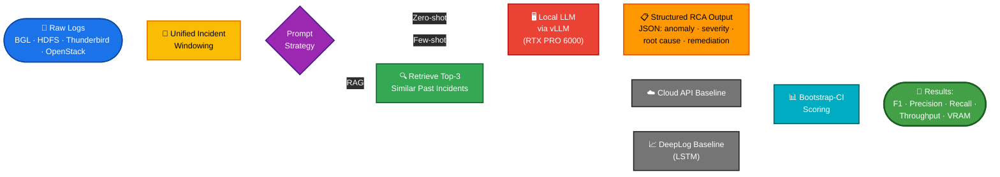
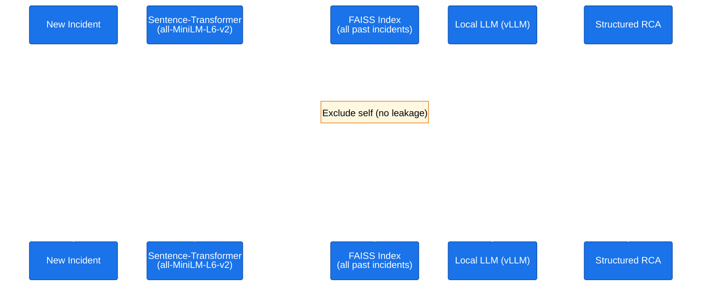
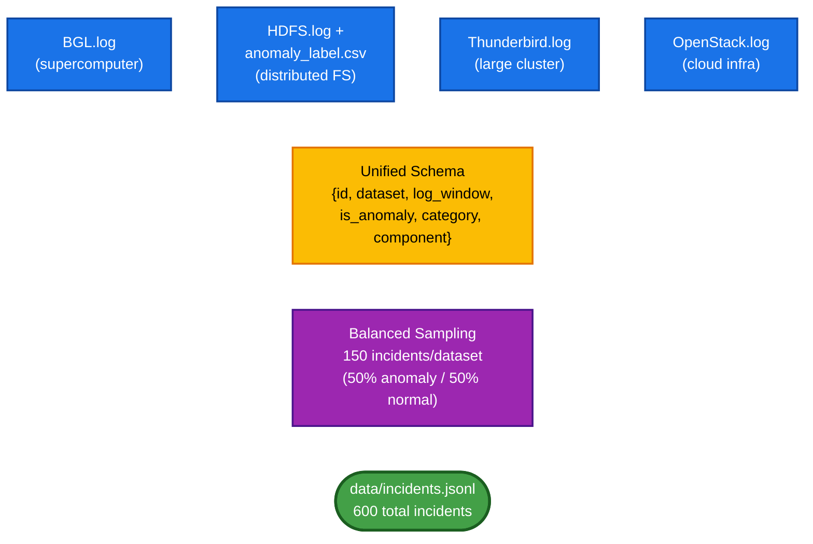
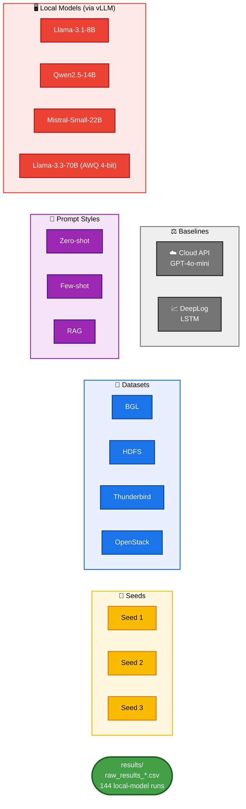
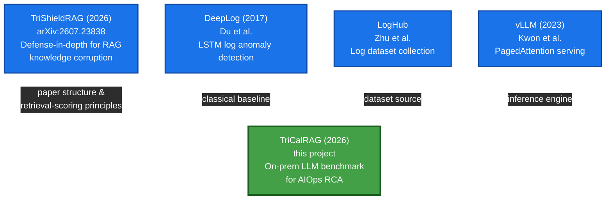
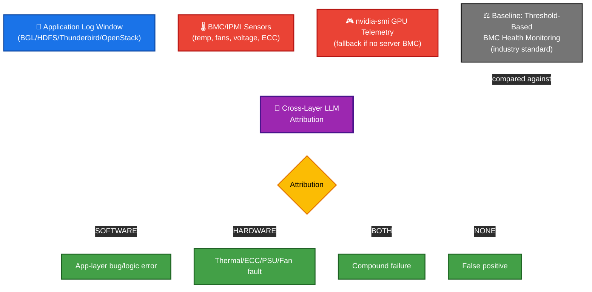
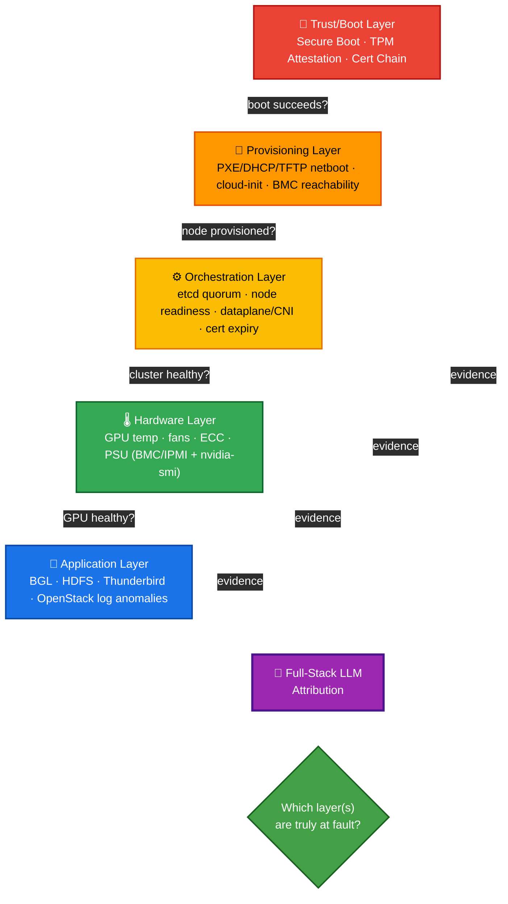

<div align="center">

# 🛡️ TriCalRAG

### On-Premise, Three-Strategy, Retrieval-Augmented LLM Benchmark for AIOps Root Cause Analysis

*Can a single high-memory workstation GPU - running open-weight LLMs with retrieval over past incidents - match cloud APIs and classical ML for log-based anomaly detection and root cause analysis?*

[]()
[]()
[]()
[]()
[-76B900)]()
[]()

[Overview](#-overview) • [Why This Matters](#-why-this-matters) • [Architecture](#-system-architecture) • [Benchmark Scope](#-benchmark-scope) • [Repo Structure](#-repository-structure) • [Reproduce](#-reproducing-results) • [Extensions](#-extensions--future-work--preliminary-synthetic) • [Citation](#-citation)

</div>

---

## 📌 Overview

**TriCalRAG** benchmarks whether open-weight LLMs, served entirely on a single **NVIDIA RTX PRO 6000 (96GB VRAM)** workstation via **vLLM**, can match cloud-API LLMs and classical ML for **root cause analysis (RCA)** on real production log data - with an added **retrieval-augmented generation (RAG)** layer that surfaces similar past incidents before the model reasons about a new one.

This is a **benchmark**, not a single experiment: it's built on real, public datasets and real model runs, so results are reused, extended, and cited by anyone evaluating on-prem LLM deployment for AIOps. A preliminary, clearly-labeled exploration into full-stack (hardware/boot/provisioning) RCA is documented separately under [Extensions](#-extensions--future-work--preliminary-synthetic) - it is not part of the core validated results.

## 🎯 Why This Matters

| Problem | TriCalRAG's Angle |
|---|---|
| Cloud LLM APIs for log analysis risk **data privacy leaks** and don't scale cost-wise with log volume | Everything runs **on-premise**, on hardware most infra teams could actually own |
| Classical anomaly detectors (LSTM-based) flag *that* something broke, not *why* | LLMs generate **natural-language root cause + remediation**, not just a flag |
| Most LLM-serving benchmarks assume **multi-GPU clusters** | This benchmarks what a **single workstation-class GPU** can realistically deliver |
| Naive prompting has no access to institutional incident history | **RAG** retrieves the top-k most similar past incidents as precedent before generating RCA |

**Who this is for:** any organization standing up private, on-premise AI infrastructure - bare-metal GPU fleets for internal inference, custom hardware clusters, or any enterprise that can't or won't send logs to a third-party cloud API.

## 🧩 What This Builds On

- **Original to this project**: the benchmark design, RAG-for-RCA application, multi-dataset + multi-baseline harness, and single-GPU-workstation framing.
- **[TriShieldRAG](https://arxiv.org/abs/2607.23838)** *(Mohanty, Patel, Yuvaraj, Chaudhary, Singhania, 2026)* - our own prior work on defense-in-depth for RAG pipelines; referenced here for paper structure and presentation style. See [Citation](#-citation) below.
- **[DeepLog](https://dl.acm.org/doi/10.1145/3133956.3134015)** *(Du et al., 2017)* - the classical LSTM-based log anomaly baseline this benchmark compares against.
- **[LogHub](https://github.com/logpai/loghub)** - source of all four real-world log datasets.
- **[vLLM](https://github.com/vllm-project/vllm)** - the inference serving engine powering every local model run.

## 🗺️ System Architecture

### 1. End-to-End Pipeline



**What this shows:** every incident flows through one of three prompting strategies before hitting the LLM. The RAG path adds a retrieval step that the zero-shot and few-shot paths skip entirely - this is the core experimental variable the benchmark measures.

---

### 2. RAG Retrieval - Detailed Sequence



**What this shows:** the retrieval step happens *before* the LLM ever sees the new incident - it's given real historical precedent (with known ground-truth outcomes) as context, similar to how an SRE would check a runbook before diagnosing a new alert. The "exclude self" step is critical for fairness: an incident can never retrieve itself as its own precedent.

---

### 3. Multi-Dataset Normalization



**What this shows:** four structurally different raw log formats get parsed by dataset-specific loaders, then converge into one common schema - this is what lets every downstream script (benchmark, scoring, ablations) stay dataset-agnostic.

---

### 4. Benchmark Execution Matrix



**What this shows:** the full combinatorial scope - 4 local models × 3 prompt styles × 4 datasets × 3 seeds = **144 local-model runs**, plus baseline comparisons on top. This is what "benchmark" means here, not a single experiment.

---

### 5. Scoring & Statistical Pipeline

```mermaid
%%{init: {'theme': 'base', 'themeVariables': { 'lineColor': '#ffffff', 'edgeLabelBackground': '#2d2d2d', 'textColor': '#ffffff' }}}%%
flowchart LR
    A(["raw_results_*.csv<br/>(all seeds, all prompt styles)"]):::input --> B["Group by<br/>model × dataset × prompt_style"]:::process
    B --> C["Compute F1, Precision,<br/>Recall, Accuracy"]:::compute
    C --> D["Bootstrap Resampling<br/>(1000 iterations)"]:::bootstrap
    D --> E["95% Confidence<br/>Intervals"]:::ci
    E --> F(["summary_metrics.csv<br/>(per dataset)"]):::result
    E --> G(["macro_summary.csv<br/>(averaged across datasets)"]):::result
    F --> H["📄 Paper Tables<br/>& Figures"]:::final
    G --> H

    classDef input fill:#1a73e8,stroke:#0d47a1,stroke-width:2px,color:#ffffff
    classDef process fill:#9c27b0,stroke:#4a148c,stroke-width:2px,color:#ffffff
    classDef compute fill:#00acc1,stroke:#006064,stroke-width:2px,color:#ffffff
    classDef bootstrap fill:#fbbc04,stroke:#e37400,stroke-width:2px,color:#000000
    classDef ci fill:#ff9800,stroke:#e65100,stroke-width:2px,color:#000000
    classDef result fill:#43a047,stroke:#1b5e20,stroke-width:2px,color:#ffffff
    classDef final fill:#ea4335,stroke:#b31412,stroke-width:3px,color:#ffffff
    linkStyle default stroke:#ffffff,stroke-width:2px,color:#ffffff
```



**What this shows:** why the results are trustworthy - every reported F1 score comes with a bootstrap-derived confidence interval, not a single noisy number from one run.

---

### 6. Research Lineage



**What this shows:** TriCalRAG is original in its combination and application (on-prem AIOps RCA), while drawing on established prior work for structure (TriShieldRAG), baseline comparison (DeepLog), data (LogHub), and infrastructure (vLLM) - see [What This Builds On](#-what-this-builds-on) for details.

---

## 📊 Benchmark Scope

|  | BGL | HDFS | Thunderbird | OpenStack |
|---|:---:|:---:|:---:|:---:|
| 🦙 Llama-3.1-8B | ✅ | ✅ | ✅ | ✅ |
| 🐦 Qwen2.5-14B | ✅ | ✅ | ✅ | ✅ |
| 🌬️ Mistral-Small-22B | ✅ | ✅ | ✅ | ✅ |
| 🦙 Llama-3.3-70B (AWQ 4-bit) | ✅ | ✅ | ✅ | ✅ |
| ☁️ Cloud API (GPT-4o-mini) | ✅ | ✅ | ✅ | ✅ |
| 📈 DeepLog (LSTM baseline) | ✅ | ✅ | ✅ | ✅ |

Each local model is evaluated under **three prompting strategies** - zero-shot, few-shot, and RAG (FAISS + sentence-transformer retrieval of top-3 similar past incidents) - across **3 random seeds**, with **bootstrap 95% confidence intervals** on every metric.

## 📁 Repository Structure

```
.
├── benchmark/                            # CORE - real datasets, real models, validated results
│   ├── loaders/multi_dataset_loader.py   # normalizes BGL/HDFS/Thunderbird/OpenStack
│   ├── prompts.py                        # zero-shot, few-shot, RAG prompt templates
│   ├── retrieval.py                      # FAISS + sentence-transformer retrieval index
│   ├── benchmark.py                      # main vLLM benchmark runner
│   ├── score_results.py                  # bootstrap CI scoring
│   └── ablation.py                       # batch-size sweep + quantization comparison
├── baselines/
│   └── deeplog_baseline.py               # classical LSTM log anomaly baseline
├── extensions/                           # PRELIMINARY - synthetic, not core results (see extensions/README.md)
│   ├── README.md                         # scope statement + path to making this real
│   ├── extension_prompts.py              # cross-layer + full-stack prompt templates
│   ├── hardware-cross-layer/
│   │   ├── ipmi_collector.py             # BMC/IPMI telemetry collector (+ nvidia-smi fallback)
│   │   ├── fault_injection.py            # synthetic hardware fault signature injection
│   │   └── bmc_threshold_baseline.py     # classic threshold-based BMC monitoring baseline
│   └── fullstack-trust-provisioning/
│       └── layered_incidents.py          # trust-chain + provisioning + orchestration synthetic incidents
├── paper/
│   ├── main.tex                          # IEEE-format paper
│   ├── references.bib
│   ├── generate_diagrams.py              # figure generation
│   └── figures/
├── END_TO_END.md                         # full step-by-step run guide
└── README.md
```

## ⚙️ Hardware

- **GPU**: NVIDIA RTX PRO 6000, 96GB VRAM, single-node workstation
- **Inference**: vLLM (local models) - retrieval embeddings run on CPU, no VRAM contention

## 📚 Datasets

Sourced from **[LogHub](https://github.com/logpai/loghub)**: BGL, HDFS, Thunderbird, OpenStack. See each dataset's original license/terms before redistribution.

## 🚀 Reproducing Results

```bash
# 1. Environment setup
python3 -m venv logsentinel-env && source logsentinel-env/bin/activate
pip install -r benchmark/requirements.txt

# 2. Prepare dataset (after downloading LogHub datasets)
python benchmark/loaders/multi_dataset_loader.py --seed 42 --out benchmark/data/incidents.jsonl

# 3. Run benchmark (repeat for seeds 1,2,3 and all 3 prompt styles)
python benchmark/benchmark.py --seed 1 --prompt-style rag

# 4. Score results
python benchmark/score_results.py
```

📖 Full step-by-step instructions: [`END_TO_END.md`](./END_TO_END.md)

---

## 🔬 Extensions & Future Work - Preliminary, Synthetic

> **Scope note:** everything below this line is exploratory and uses synthetically generated or synthetically injected data - it is **not part of the core benchmark's validated results** above. No public dataset pairs real BMC/IPMI, boot-trust, or bare-metal provisioning telemetry with labeled incidents at scale, so these extensions demonstrate *feasibility and methodology*, not validated findings. See [`extensions/README.md`](./extensions/README.md) for the full scope statement and a concrete path to making this real (OpenTelemetry-based collection, Redfish/Ansible-based BMC interaction, real fault injection on test hardware).

### Extension A - Cross-Layer RCA: Software + Hardware (IPMI/BMC)



**What this shows:** the new cross-layer task combines application logs with hardware telemetry to attribute an incident's *true* root cause - something neither layer can determine alone. A software error log during a thermal-throttle event has a different remediation than the same log during normal hardware conditions.

> ⚠️ **Methodology note:** real BMC/IPMI hardware fault data paired with real software incidents doesn't exist as a public dataset. Hardware fault signatures here are **synthetically injected**, modeled on documented failure characteristics (thermal ramp curves, ECC burst patterns, PSU voltage instability, fan RPM collapse) - see [`fault_injection.py`](../extensions/hardware-cross-layer/fault_injection.py). This is standard fault-injection methodology, reported transparently rather than presented as real-world hardware failure telemetry.

---

### Extension B - Full-Stack RCA: Trust → Provisioning → Orchestration → Hardware → Application



**What this shows:** a real bare-metal incident can originate at any of five layers, and a failure at an earlier layer (e.g., boot-time trust) often *masquerades* as a failure at a later layer (e.g., "node NotReady" at the orchestration layer, when the true cause is a rejected unsigned bootloader at the trust layer). The full-stack task tests whether an LLM can trace back to the *earliest* true fault rather than stopping at the first visible symptom - this is the core skill a real platform engineer applies during incident response.

> ⚠️ **Methodology note:** as with the hardware layer, there is no public dataset of real boot/provisioning/orchestration incidents with ground-truth labels. This layer uses **synthetic narrative generation** modeled on well-documented, generic industry failure patterns (PXE/DHCP/TFTP boot chain mechanics, TPM/Secure Boot attestation, Kubernetes orchestration failure modes) - see [`layered_incidents.py`](../extensions/fullstack-trust-provisioning/layered_incidents.py). No real infrastructure, vendor, or organization-specific data is used.


## 📖 Citation

If you use TriCalRAG in your research, please cite:

```bibtex
@misc{rohitpatel2026tricalrag,
  title={TriCalRAG: A Three-Strategy, Retrieval-Augmented Benchmark for On-Premise LLM-Based Root Cause Analysis in AIOps},
  author={Patel, Rohit and Mohanty, Susil Kumar and Chaudhary, Jeenal},
  year={2026},
  howpublished={\url{https://github.com/SPriTLab-iitj/TriCalRAG}}
}
```

*(arXiv citation to be added upon submission.)*

This work also draws on our related prior paper on securing RAG pipelines:

```bibtex
@article{rohitpatel2026trishieldrag,
  title={TriShieldRAG: A Three-Ring Defense-in-Depth Framework Against Knowledge Corruption in Retrieval-Augmented Generation},
  author={Mohanty, Susil Kumar and Patel, Rohit and Yuvaraj, Kosuru and Chaudhary, Jeenal and Singhania, Disha},
  journal={arXiv preprint arXiv:2607.23838},
  year={2026}
}
```

## 📄 License

*(Choose a license - MIT or Apache 2.0 are common for benchmark code. Add a `LICENSE` file before making the repo public.)*

## 🙏 Acknowledgments

Built on [vLLM](https://github.com/vllm-project/vllm), [LogHub](https://github.com/logpai/loghub), and [FAISS](https://github.com/facebookresearch/faiss). Baseline methodology inspired by DeepLog (Du et al., 2017). Paper structure and presentation inspired by our own prior work, TriShieldRAG (arXiv:2607.23838).

---

<div align="center">

*Part of ongoing AIOps Research Work.*

</div>
